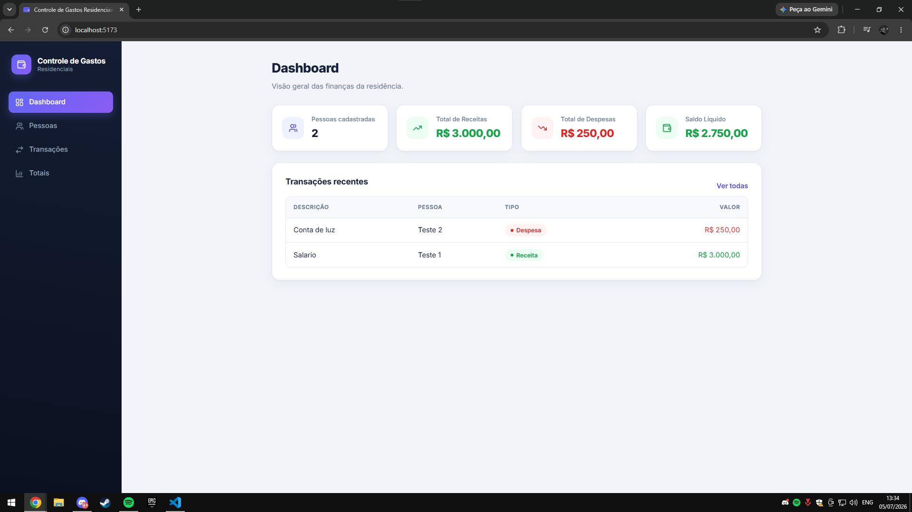
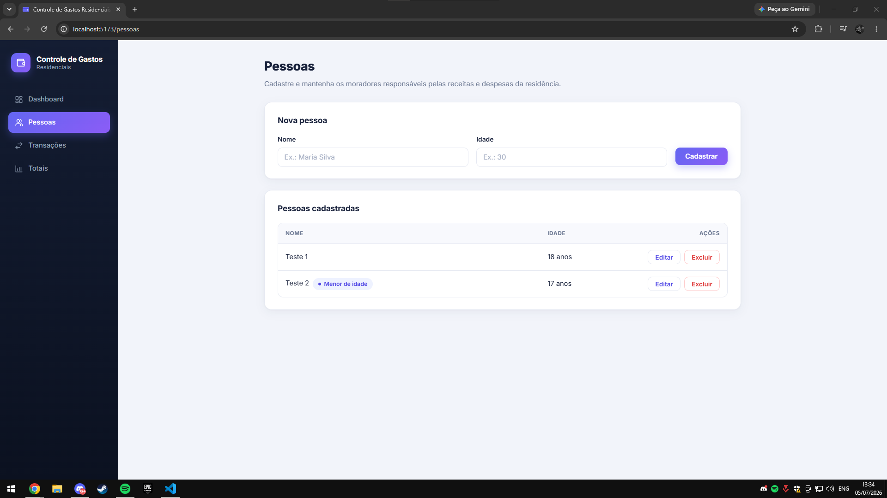
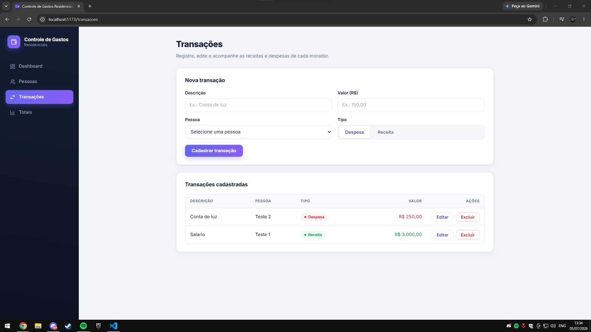
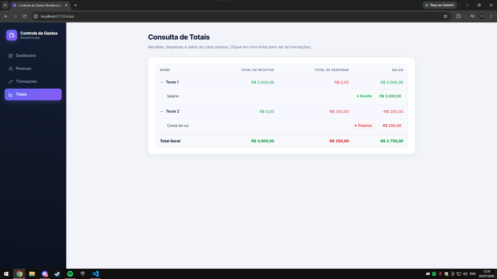

# Sistema de Controle de Gastos Residenciais

Sistema para organizar as finanças de uma casa: cadastro dos moradores, registro de receitas e despesas e consulta dos totais de cada um.

## Funcionalidades

- Gerenciamento de moradores
- Cadastro de receitas e despesas
- Consulta de totais por pessoa
- Dashboard com resumo financeiro
- Excluir automaticamente as transações ao remover uma pessoa
- Regra que impede menores de idade de cadastrar receitas
- Persistência dos dados em SQLite

## Tecnologias

**Backend:** C#, .NET 8, ASP.NET Core Web API, Entity Framework Core, SQLite.

**Frontend:** React, TypeScript, Vite, React Hook Form, Zod, CSS.

## Screenshots









## Como rodar o backend

Pré-requisito: .NET SDK 8+

```bash
cd Backend
dotnet run --project src/ControleGastos.Api
```

## Como rodar o frontend

Pré-requisito: Node.js 20+

```bash
cd Frontend
npm install
npm run dev
```

## Decisões técnicas

Algumas escolhas que fiz durante o desenvolvimento:

- Backend organizado em camadas (Domain, Application, Infrastructure e Api).
- Utilizei FluentValidation para retornar mensagens de erro mais claras pro frontend.
- Escolhi o SQLite pela simplicidade, sem precisar de nada por fora.
- Configurei a exclusão em cascata, ao excluir uma pessoa, suas transações são excluidas.
- React Hook Form + Zod, para facilitar o gerenciamento e a validação dos formulários.
- Desenvolvi utilizando CSS puro na interface, para melhor controle e sem dependências.

## Autor

Adryano de Oliveira Cavalcanti Filho

GitHub:
https://github.com/AdryanoFilho
